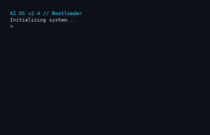

# AI.OS // Identity Terminal

<p align="center">
  
</p>

<p align="center">
  <b>Initializing Human Intelligence...</b><br/>
  <b>Loading Artificial Intelligence...</b><br/>
  <b>Welcome, Vrathik Shenoy.</b>
</p>

---

## ⌨️ Command Console
*Type a command to jump to a directory node, or scroll to proceed:*

<p align="center">
  <code><b>[guest@ai-os ~]$</b></code> 
  <a href="#identity-dashboard"><code>cat about.md</code></a> &nbsp;|&nbsp;
  <a href="#featured-projects"><code>ls projects/</code></a> &nbsp;|&nbsp;
  <a href="#tech-arsenal"><code>sysctl hardware</code></a> &nbsp;|&nbsp;
  <a href="#live-system-monitor"><code>top -d 1</code></a> &nbsp;|&nbsp;
  <a href="#terminal-footer"><code>exit</code></a>
</p>

---

<h2 id="identity-dashboard">👤 Section 2 & 3 — Animated ASCII Portrait & Dashboard</h2>

<p align="center">
  <table border="0" cellpadding="10" cellspacing="0" align="center">
    <tr style="border: none; background: transparent;">
      <td valign="top" style="border: none; background: transparent; padding-right: 20px;">
        
      </td>
      <td valign="top" style="border: none; background: transparent;">
        <pre>
╭────────────────────────────────────────────╮
│ <a href="https://github.com/vrathikshenoy"><b>Vrathik Shenoy</b></a>                            │
├────────────────────────────────────────────┤
│ <b>Role</b>      AI Engineer                      │
│ <b>Focus</b>     Computer Vision & GenAI           │
│ <b>Stack</b>     PyTorch | CUDA | OpenCV          │
│ <b>Mission</b>   Build useful AI products         │
│ <b>Status</b>    Building Wearify                 │
│ <b>System</b>    <!-- SYNC_TIME_START -->System Sync: 2026-07-15 11:24:01 UTC (Active)<!-- SYNC_TIME_END -->  │
╰────────────────────────────────────────────╯
        </pre>
        <h3>Current Mission</h3>
        <blockquote>
          <i>"Bridging research and production. Accelerating vision-language models, diffusion frameworks, and building immersive, next-gen consumer products."</i>
        </blockquote>
      </td>
    </tr>
  </table>
</p>

---

<h2 id="ai-radar">📊 Section 4 — AI Radar</h2>

```
Computer Vision
████████████████████████████████████████ 92%

Diffusion Models
████████████████████████████████      80%

LLMs & VLMs
████████████████████████████          70%

Backend / MLOps
████████████████████████              60%

AI Research
████████████████████████████████      80%
```

---

<h2 id="neural-network">🧠 Section 5 — Neural Network Connectors</h2>

```
   [ Input Data ]
         ●
         │
         ▼
    ●────●────●  (Preprocessing & Augmentation)
   /     │     \
  ▼      ▼      ▼
  ●────●───●────●  (Vision Backbone / Feature Extractor)
  │    \   /    │
  │     \ /     │
  ▼      ▼      ▼
  ●──────●──────●  (Diffusion / VLM Alignment)
         │
         ▼
  [ Featured Projects ]
```

---

<h2 id="current-experiments">🧪 Section 6 — Current Experiments</h2>

- **✓ Wearify** — Virtual Try-On for e-commerce.
- **✓ Multi-view Virtual Try-On** — Generating realistic multi-angle garment fits.
- **✓ Vision Language Models** — Aligning text-image understanding for downstream tasks.
- **✓ Diffusion Optimization** — Fine-tuning and accelerating text-to-image pipelines.
- **✓ AI Startup** — Turning research into viable consumer software products.

---

<h2 id="mission-timeline">⏳ Section 7 — Mission Timeline</h2>

```
  2022 ──► Started AI Journey (Exploring Deep Learning basics)
            │
            ▼
  2023 ──► Specialized in Computer Vision (OpenCV, classical ML, CNN architectures)
            │
            ▼
  2024 ──► Advanced AI Research & Generative Modeling (Diffusion, PyTorch, CUDA acceleration)
            │
            ▼
  2025 ──► Wearify & VTON Systems (Developing deep generative try-on engines)
            │
            ▼
  2026 ──► Building scalable AI Products (Current active node)
```

---

<h2 id="featured-projects">📁 Section 8 — Featured Projects</h2>

<table border="0" cellpadding="10" cellspacing="0" width="100%">
  <tr style="border: none; background: transparent;">
    <td width="50%" valign="top" style="border: none; background: transparent;">
      <pre>
┌──────────────────────────────────────────┐
│ <b>PROJECT_001 // Wearify</b>                   │
├──────────────────────────────────────────┤
│ <b>Status</b>     <font color="#3FB950">● RUNNING</font>                     │
│ <b>Type</b>       Virtual Try-On System         │
│ <b>Stack</b>      Python | PyTorch | CUDA       │
│            Next.js                       │
├──────────────────────────────────────────┤
│ Engine for realistic clothing transfer   │
│ from garment image onto person image.    │
│                                          │
│ <a href="https://github.com/vrathikshenoy/wearify-claude"><b>Access Repository ──►</b></a>                    │
└──────────────────────────────────────────┘
      </pre>
    </td>
    <td width="50%" valign="top" style="border: none; background: transparent;">
      <pre>
┌──────────────────────────────────────────┐
│ <b>PROJECT_002 // Gemini AI Try-On</b>          │
├──────────────────────────────────────────┤
│ <b>Status</b>     <font color="#39D0FF">● COMPLETED</font>                   │
│ <b>Type</b>       Multi-modal Try-On App        │
│ <b>Stack</b>      Python | Gemini API | Bun     │
│            TailwindCSS                   │
├──────────────────────────────────────────┤
│ Virtual Try-on workflow powered by       │
│ Google Gemini Multimodal APIs.           │
│                                          │
│ <a href="https://github.com/vrathikshenoy/gemini-ai-tryon"><b>Access Repository ──►</b></a>                    │
└──────────────────────────────────────────┘
      </pre>
    </td>
  </tr>
</table>

---

<h2 id="tech-arsenal">🛠️ Section 9 — Tech Arsenal</h2>

```
Neural Stack & Engine
Python       ████████████████████████████████████████ 100%
PyTorch      ████████████████████████████████████████ 100%
CUDA         ████████████████████████████████         80%
OpenCV       ████████████████████████████████████     90%
Transformers ████████████████████████████             70%
Next.js      ████████████████████                     50%
```

---

<h2 id="live-system-monitor">🖥️ Section 10 — Live System Monitor</h2>
<p align="center">
  
</p>

---

<h2 id="github-stats">📈 Section 11 — GitHub Statistics</h2>

<p align="center">
  
  &nbsp;&nbsp;
  
</p>

---

<h2 id="research-feed">📚 Section 12 — Research Feed</h2>

- 🌟 **Virtual Try-On (VTON)** — Diffusion-based models for high-fidelity clothing drape estimation.
- 🌟 **Diffusion Models** — Latent diffusion architecture optimization, memory reductions, and fast inference.
- 🌟 **Fashion AI** — Semantic segmentations, pose estimations, and garment warping pipelines.
- 🌟 **Vision Transformers** — Cross-attention mapping in text-to-image synthesis models.
- 🌟 **Multi-modal Systems** — Large Language Models conditioned on complex visual scene contexts.

---

<h2 id="philosophy">🧠 Section 13 — Philosophy</h2>

<!-- QUOTE_START -->
```
"while(alive) { learn(); build(); share(); repeat(); }"
```
<!-- QUOTE_END -->

---

<h2 id="terminal-footer">🛑 Terminal Footer</h2>

```
Connection closed.
Have a nice day, traveler.

[guest@ai-os ~]$ exit
logout

[Process completed]
```

<p align="center">
  <b>█</b>
</p>
